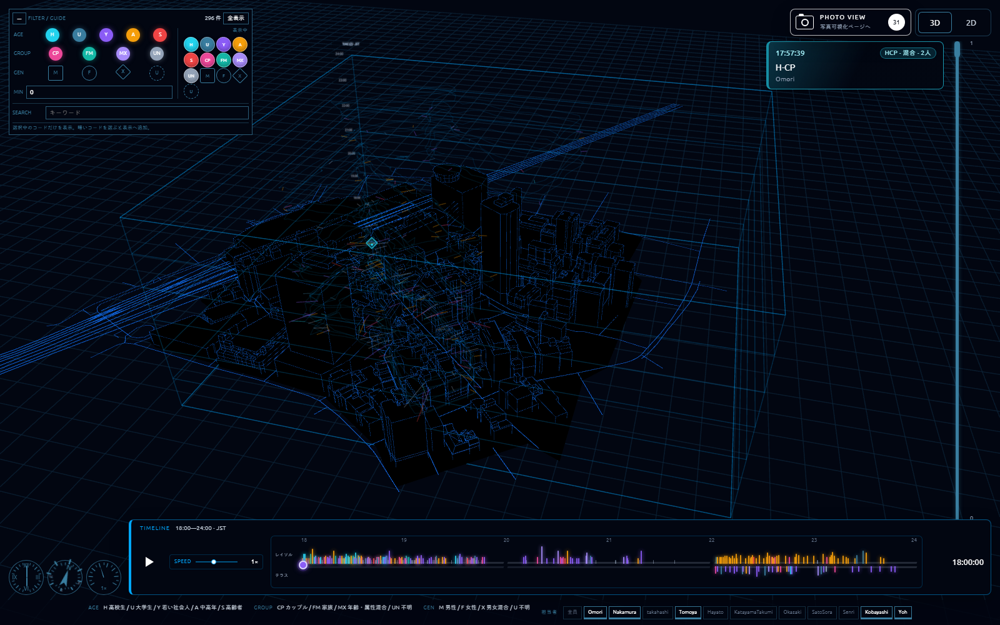
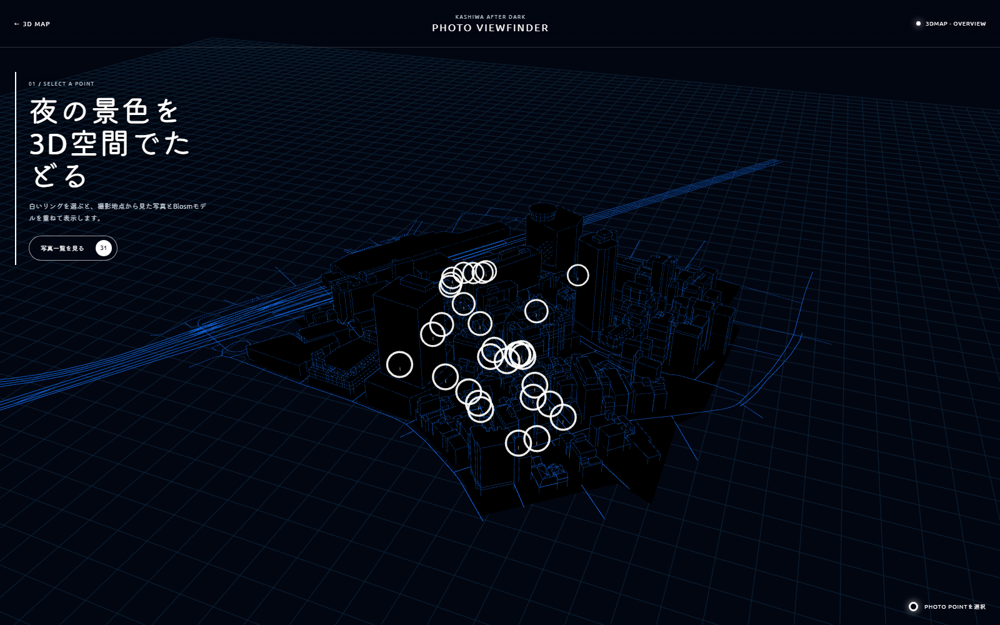

# 3DMAP Data Visualization

柏駅周辺の3Dマップに、GPXによる移動・観察データと夜間写真を重ねて表示する可視化サイトである。
ゼミ紹介サイトとは分離し、本リポジトリでは可視化に必要なコードと公開用素材を管理する。

## 目次

- [概要](#概要)
- [公開ページ](#公開ページ)
- [機能紹介](#機能紹介)
  - [3Dマップと移動軌跡](#3dマップと移動軌跡)
  - [時間軸とタイムライン再生](#時間軸とタイムライン再生)
  - [観察メモとフィルター](#観察メモとフィルター)
  - [2D表示と計器](#2d表示と計器)
  - [写真ViewFinder](#写真viewfinder)
  - [写真視点調整](#写真視点調整)
- [ディレクトリ構成](#ディレクトリ構成)
- [主要ファイル](#主要ファイル)
- [使用技術](#使用技術)
- [データと素材](#データと素材)
- [ローカル表示](#ローカル表示)
- [開発メモ](#開発メモ)

## 概要

本サイトは、柏駅周辺で収集した移動軌跡、観察メモ、夜間写真を3D都市モデル上で横断的に確認するためのWebアプリケーションである。18:00から24:00までの調査データを時間軸に沿って再生し、地点・時刻・担当者・観察対象の関係を可視化する。

ビルドツールを使用しない静的Webアプリとして実装している。各サイトの `index.html` からES Modulesを直接読み込み、Three.jsはimport map経由でCDNから取得する構成である。

## 公開ページ

- [メイン3Dマップ](https://kashiwa-after-dark.github.io/3DMAP_DataVisu/)
- [ルートヒストリー可視化サイト](https://kashiwa-after-dark.github.io/3DMAP_DataVisu/route-history/)
- [写真ViewFinder](https://kashiwa-after-dark.github.io/3DMAP_DataVisu/photo-visualization/)
- [写真視点調整用ページ](https://kashiwa-after-dark.github.io/3DMAP_DataVisu/photo-visualization/dev/)

旧URLの `phtos_DataVisu/` と `phtos_DataVisu/dev/` は、それぞれ上記の新しいページへ自動転送する。

## 機能紹介

### 3Dマップと移動軌跡



`assets/models/Kashiwa_3Dmap.glb` を読み込み、柏駅周辺の都市モデルを表示する。Three.jsの `PerspectiveCamera` と `OrbitControls` により、地図の回転、ズーム、パンが可能である。

`assets/data/gpx/RH01_0707/` にあるGPXファイルを読み込み、各担当者の移動軌跡を3D空間上に描画する。GPX内の `trkpt` を移動ルート、`wpt` を観察メモとして扱う。読み込むファイル、担当者名、初期表示、タイムライン上のレーン分類は `shared/js/config.js` の `GPX_FILES` で管理する。

通常表示では黒と青を基調にしたモデルを使用する。写真表示では `kashiwa_Blosm.glb` または `kashiwa_Blosm.fbx` に切り替え、写真と詳細な都市モデルを比較する。

### 時間軸とタイムライン再生

18:00から24:00までの観察時間をタイムラインとして扱う。再生ボタンを押すと、調査時間全体を30秒で再生する設計である。

- 再生、一時停止、リピート
- 0.25倍から2倍までの再生速度変更
- スライダーによる時刻移動
- 3D空間の高さ方向を利用した時間表現
- ルートの進行位置を示すヘッドマーカー
- ルート下に表示するカーテン状の時間面
- レイソル側、テラス側に分けた観察イベント表示

### 観察メモとフィルター

GPXのウェイポイントから観察メモを抽出し、3D空間と画面右側のメモパネルに表示する。メモを選択すると、カメラが該当する観察地点へ移動する。

メモ内の記号から年齢層、性別、人数、グループ属性を推定する。`HM`、`YF`、`CP`、`FM`、`MX` などのコードを読み取り、表示色やマーカー形状へ反映する。

画面左側の `FILTER / GUIDE` では、次の条件で観察データを絞り込める。

| 分類 | 条件 |
| --- | --- |
| 年齢層 | `H` 高校生、`U` 大学生、`Y` 若い社会人、`A` 中高年、`S` 高齢者 |
| グループ | `CP` カップル、`FM` 家族、`MX` 属性混合、`UN` その他・不明 |
| 性別 | `M` 男性、`F` 女性、`X` 混合、`U` 不明 |
| その他 | 最小人数、キーワード、担当者 |

担当者フィルターはタイムラインのレーン強調とも連動する。

### 2D表示と計器

`3D / 2D` ボタンで表示を切り替えられる。2D表示では `OrthographicCamera` を使用し、時間軸と移動軌跡を横から見たグラフとして表示する。ドラッグによる視点移動とホイールによるズームが可能である。

画面右側には、タイムラインと連動する次の計器を表示する。

- アナログ時計: 現在の再生時刻
- コンパス: カメラの向きと仰角
- スピードメーター: 現在の再生速度

### 写真ViewFinder



`photo-visualization/` は、撮影写真と3Dモデルを重ねて比較するサイトである。地図上の白いリングまたは写真一覧から写真を選択し、撮影地点から見た夜間写真とBlosmモデルを表示する。

- 31枚の選定済み写真を表示
- 写真撮影時刻とGPX軌跡から撮影地点を推定
- 方角情報がある写真では撮影方向を使用
- 方角情報がない写真では移動方向を撮影方向として使用
- スライダーによる写真透明度の調整
- 左右ボタンまたは左右矢印キーによる写真移動
- `Esc` キーによる全体地図への復帰

公開版では写真サイズとFOVの調整機能を非表示にし、写真の不透明度は70%から自由に変更できる。

### 写真視点調整

`photo-visualization/dev/` は開発用の視点調整ページである。写真と3Dモデルの重なりを確認しながら、各写真のカメラ位置、回転、画角を調整する。

- `視点調整を開始` から31枚を順番に調整
- 左ドラッグによる角度調整
- 右ドラッグまたは `Shift` + ドラッグによる位置調整
- ホイールによる前後移動
- `WASD` による水平移動と `Q/E` による上下移動
- 座標と角度の数値入力
- `PHOTO SIZE` と `PERSPECTIVE / FOV` の調整
- `localStorage` への調整内容の一時保存
- カメラ座標、回転角、クォータニオン、FOV、写真倍率のJSON出力
- devの写真一覧で写真を開き、「修正する」からその写真の視点調整へ移行
- 調整結果をGitHubへ直接保存し、公開サイトの更新を開始

GitHubへの直接保存では、初回のみ対象リポジトリの `Contents: Read and write` 権限を持つfine-grained personal access tokenを入力する。トークンはそのブラウザタブのセッション内だけに保持され、ソースコードには保存されない。

## ディレクトリ構成

```text
.
├── index.html                 # ルートヒストリーサイトへの転送ページ
├── README.md                  # プロジェクト説明
├── route-history/             # ルートヒストリー可視化サイト
│   ├── index.html
│   ├── css/
│   └── js/
│       └── features/
├── photo-visualization/       # 写真可視化サイト
│   ├── index.html
│   ├── css/
│   ├── js/
│   └── dev/                   # 写真視点調整用ページ
├── shared/                    # 両サイトで共有する処理と設定
│   └── js/
├── docs/
│   └── images/                # README掲載画像
└── assets/
    ├── models/                # 3D都市モデル
    ├── data/gpx/              # GPX形式の移動・観察データ
    └── photos/selected/       # 公開対象の選定済み写真
```

| ディレクトリ | 説明 |
| --- | --- |
| `route-history/` | ルートヒストリー可視化サイトのHTML、CSS、JavaScriptをまとめて管理する。 |
| `route-history/js/features/` | フィルター、担当者選択、メモパネル、タイムライン計器、2D表示、観察マーカーなどの機能を管理する。 |
| `photo-visualization/` | 写真地点の一覧、写真と3Dモデルの重ね合わせ、写真視点調整をまとめて管理する。 |
| `shared/js/` | 両サイトが利用するThree.jsのマップ初期化、座標変換、共通設定を管理する。 |
| `assets/models/` | 通常表示用と写真比較用の3D都市モデルを格納する。 |
| `assets/data/gpx/` | 担当者ごとの移動軌跡と観察メモを含むGPXファイルを格納する。 |
| `assets/photos/selected/` | ViewFinderで使用する公開対象の写真を格納する。 |
| `docs/images/` | READMEの機能紹介に掲載する画面画像を格納する。 |

## 主要ファイル

| ファイル | 役割 |
| --- | --- |
| `index.html` | 公開トップから `route-history/` へ転送する。 |
| `route-history/index.html` | 3D/2D切り替え、タイムライン、フィルター、メモ一覧、写真サイトへの導線を配置する。 |
| `route-history/js/index.js` | GPX読み込み、タイムライン再生、軌跡描画、フィルター連携、カメラ制御を統括する。 |
| `route-history/js/gpxData.js` | GPXを解析し、移動軌跡と観察メモへ変換する。 |
| `route-history/js/formatters.js` | 時刻やラベルなどの表示形式を整える。 |
| `route-history/js/features/filters.js` | 観察属性による絞り込みを管理する。 |
| `route-history/js/features/map2d.js` | 2D表示への切り替えと操作を管理する。 |
| `route-history/js/features/memoPanel.js` | 観察メモの一覧表示と選択処理を管理する。 |
| `route-history/js/features/instruments.js` | 時計、コンパス、スピードメーターを管理する。 |
| `route-history/js/features/markers.js` | 3D空間上の観察マーカーを描画する。 |
| `photo-visualization/js/viewFinder.js` | 写真地点、写真の重ね合わせ、モデル切り替え、視点調整を管理する。 |
| `photo-visualization/js/photos.js` | 写真ViewFinderで使用する31枚の写真データを管理する。 |
| `photo-visualization/css/viewFinder.css` | 写真ViewFinderと視点調整画面のスタイルを管理する。 |
| `shared/js/mapDisplay.js` | レンダラー、シーン、カメラ、ライト、3Dモデル読み込み、座標変換を提供する。 |
| `shared/js/config.js` | 座標原点、表示色、時刻範囲、GPXファイル一覧、カメラモード、カテゴリ色を管理する。 |

## 使用技術

| 技術 | 用途 |
| --- | --- |
| HTML / CSS / JavaScript | 画面構造、スタイル、操作処理を構成する。 |
| ES Modules | JavaScriptを機能単位に分割して読み込む。 |
| Three.js `0.166.1` | 3Dマップ、GPX軌跡、観察マーカー、写真地点を描画する。 |
| `OrbitControls` | 3Dマップの回転、ズーム、パンを制御する。 |
| `GLTFLoader` / `FBXLoader` | `.glb` モデルとフォールバック用の `.fbx` モデルを読み込む。 |
| `DOMParser` | GPXをXMLとして解析し、移動軌跡と観察メモを抽出する。 |
| `CanvasTexture` | 観察マーカー、時刻軸ラベル、座標ラベルをスプライト化する。 |
| Google Fonts | `Kiwi Maru` と `Ubuntu` をUI表示に使用する。 |
| GitHub Pages | 静的ファイルを公開する。 |

## データと素材

### 3Dモデル

- `assets/models/Kashiwa_3Dmap.glb`
- `assets/models/kashiwa_Blosm.glb`
- `assets/models/kashiwa_Blosm.fbx`

### GPXデータ

- `assets/data/gpx/RH01_0707/`

### 写真

- `assets/photos/selected/re_photos01/`

元写真、写真処理、GPX整形は `-3DMAP_DataPipeline` 側で管理する。本リポジトリの `assets/` には公開可能な成果物のみを配置する。

## ローカル表示

ES Modules、CDN import map、3Dモデル、GPX、写真を読み込むため、各HTMLファイルを直接開かず、ローカルWebサーバー経由で表示する。

```bash
python -m http.server 8000
```

起動後、次のURLを開く。

- メインページ: `http://localhost:8000/`
- ルートヒストリー可視化サイト: `http://localhost:8000/route-history/`
- 写真ViewFinder: `http://localhost:8000/photo-visualization/`
- 写真視点調整ページ: `http://localhost:8000/photo-visualization/dev/`

## 開発メモ

- npmパッケージとビルド設定は使用しない構成である。
- Three.jsのバージョンは `route-history/index.html` と `photo-visualization/index.html` のimport mapで指定する。
- ファイル名末尾の `?v=...` は、GitHub Pagesとブラウザのキャッシュ対策である。
- GPXファイルを追加または削除する場合は、`shared/js/config.js` の `GPX_FILES` も更新する。
- 写真を追加または削除する場合は、`photo-visualization/js/photos.js` の `photoRows` と `assets/photos/selected/` の実ファイルを一致させる。
- ルートヒストリーサイトと写真サイトは `shared/js/mapDisplay.js` の3D表示セットアップを共有する。
- 公開用写真ページと開発用写真ページは同じ `viewFinder.js` を使用し、`body` の `data-viewer-mode` で動作を切り替える。
